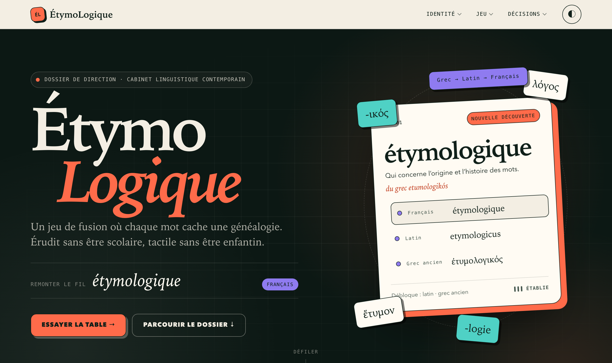
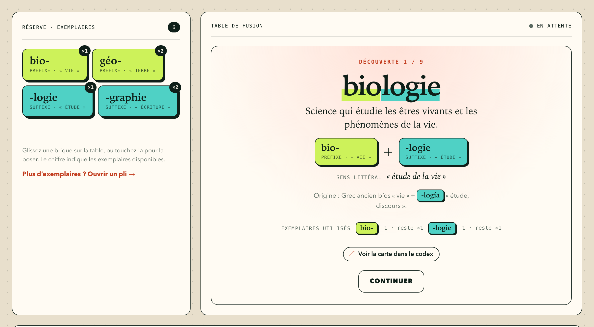
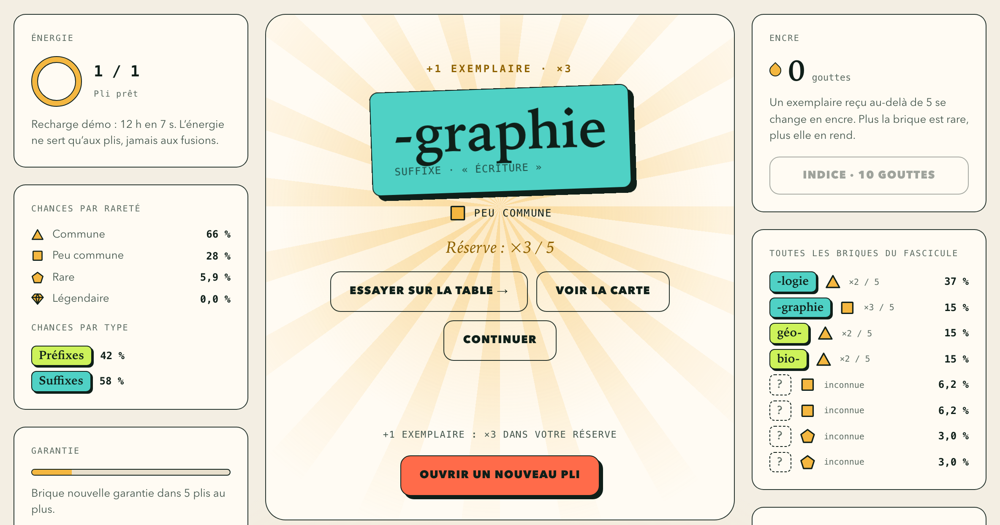
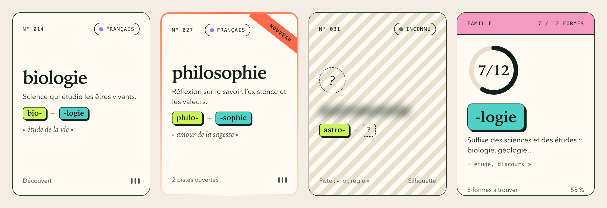
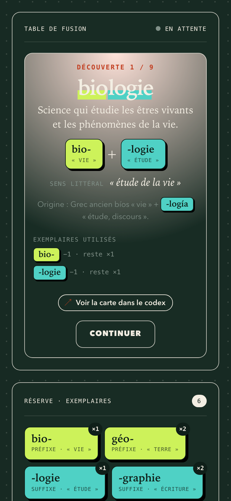
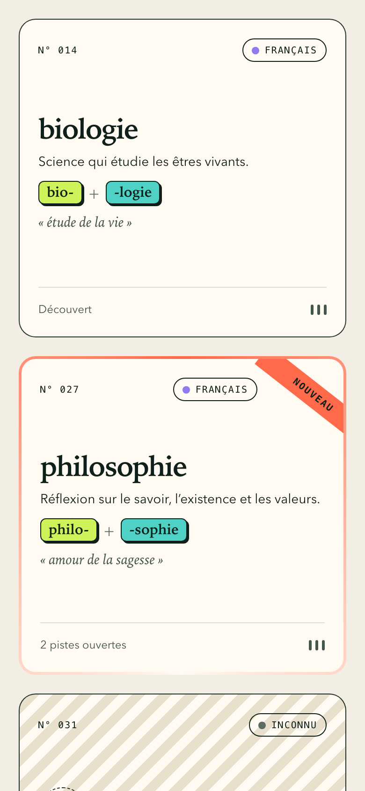

# ÉtymoLogique

[](https://lunik.github.io/EtymoLogique/)

**[Parcourir le dossier en ligne →](https://lunik.github.io/EtymoLogique/)**

> Comprendre comment les mots voyagent, se transforment et se composent en résolvant un monde de puzzles interconnectés.

**ÉtymoLogique** est un jeu de logique, de découverte et de collection. Le joueur assemble des briques linguistiques (préfixes, suffixes, racines) sur une table de fusion pour retrouver des mots et découvrir leur histoire. Chaque découverte complète un codex et ouvre de nouvelles pistes.

Ce n'est ni un dictionnaire ni un simulateur de concaténation : les recettes reposent sur un graphe éditorial de relations étymologiques, dont chaque fait est sourcé dans une référence.

## État du projet

Le dépôt contient pour l'instant le **dossier de conception** : vision du jeu, décisions d'architecture (ADR), identité visuelle, design système et démonstrations jouables en HTML statique. Il n'y a encore ni application ni dépendance à installer.

Les piliers du jeu :

- **Déduction** : une découverte s'anticipe à partir d'indices cohérents.
- **Expérimentation** : se tromper ne coûte rien, seule une découverte consomme des exemplaires.
- **Rareté des briques** : chaque exemplaire compte, les plis sont le seul moyen d'en obtenir d'autres.
- **Collection** : un codex lisible, qui donne envie de compléter une famille.
- **Transmission** : le résultat explique la relation étymologique sans casser le rythme.
- **Progression maîtrisée** : aucune brique n'est impossible à obtenir.

## Aperçu

### La table de fusion

Posez deux briques dans l'ordre de votre choix, puis fusionnez. Une découverte consomme un exemplaire de chaque brique utilisée ; une erreur ne coûte rien.

[](https://lunik.github.io/EtymoLogique/jeu.html)

### Les plis

Les plis sont le seul moyen d'obtenir des exemplaires. Les chances par rareté et par brique sont toujours affichées, et une brique nouvelle est garantie au plus tard au 6ᵉ pli.

[](https://lunik.github.io/EtymoLogique/plis.html)

### Le codex

Chaque découverte devient une carte éditoriale : découverte, nouvelle, silhouette d'un mot à trouver, ou famille à compléter.

[](https://lunik.github.io/EtymoLogique/codex.html)

### Mobile d'abord, en atelier comme en nocturne

<p align="center">
  
  &nbsp;&nbsp;
  
</p>

## Parcourir le dossier

| Document | Contenu |
|---|---|
| [docs/index.html](docs/index.html) | Accueil du dossier de direction |
| [docs/game-design.md](docs/game-design.md) | Vision, vocabulaire, boucle et règles de jeu, périmètre du MVP |
| [docs/adr/](docs/adr/README.md) | Architecture Decision Records, aussi présentés dans [adr.html](docs/adr.html) |
| [docs/modele-donnees.md](docs/modele-donnees.md) | Modèle de données du catalogue |
| [docs/identite.html](docs/identite.html), [design-system.html](docs/design-system.html) | Identité visuelle et design système |
| [docs/jeu.html](docs/jeu.html), [plis.html](docs/plis.html), [codex.html](docs/codex.html) | Démonstrations jouables : table de fusion, plis, codex |
| [docs/boussole.html](docs/boussole.html) | Piliers, ce qu'il faut cultiver, ce qu'il faut éviter |

Le dossier `docs/` est publié sur [GitHub Pages](https://lunik.github.io/EtymoLogique/) à chaque push sur `master`. Chaque autre branche est publiée sous `/branches/<nom>/`.

## Prévisualiser en local

Il suffit de Python 3 :

```sh
python3 -m http.server 8000 --directory docs   # puis ouvrez http://localhost:8000
```

La démo garde la réserve, les découvertes et les plis d'une page à l'autre, dans le stockage local du navigateur.

## Contribuer

Tout le contenu est rédigé **en français**, avec la typographie française (« guillemets », espaces insécables, apostrophe ’).

- **Changer une décision** : rédigez un nouvel ADR, qui déclare ce qu'il remplace. L'ancien est conservé.
- **Après toute modification d'un ADR**, régénérez la page : `python3 docs/scripts/build_adr.py`.
- **Modification visuelle** : contrôlez l'identité avec `python3 .agents/skills/visual-identity-check/check_identity.py --base master`.
- Respectez le vocabulaire du jeu : « pli » (jamais « pack »), « codex », « exemplaire », « réserve », « brique ».

Les sources de vérité, les règles et les skills des agents sont détaillés dans [AGENTS.md](AGENTS.md).

## Licences

ÉtymoLogique est un projet libre sous copyleft : vous pouvez l'étudier, le modifier et le redistribuer, même commercialement, à condition que vos dérivés restent libres sous la même licence ([ADR 0017](docs/adr/0017-licences.md)).

| Périmètre | Licence |
|---|---|
| Code : HTML, CSS, JavaScript, scripts, workflows | [GNU AGPL 3.0 ou ultérieure](LICENSE) |
| Contenu : documentation, ADR, textes et données du catalogue | [Creative Commons BY-SA 4.0](LICENSE-CONTENT) |
| Nom « ÉtymoLogique », logo et marque | Réservés, hors de ces licences |

- L'AGPL s'applique aussi aux services en ligne : si vous hébergez une version modifiée du jeu, publiez-en les sources.
- Si vous reprenez le contenu, créditez « ÉtymoLogique, Guillaume MARTINEZ » et gardez la licence CC BY-SA 4.0.
- Un fork doit porter un autre nom et un autre logo.

© 2026 Guillaume MARTINEZ.
