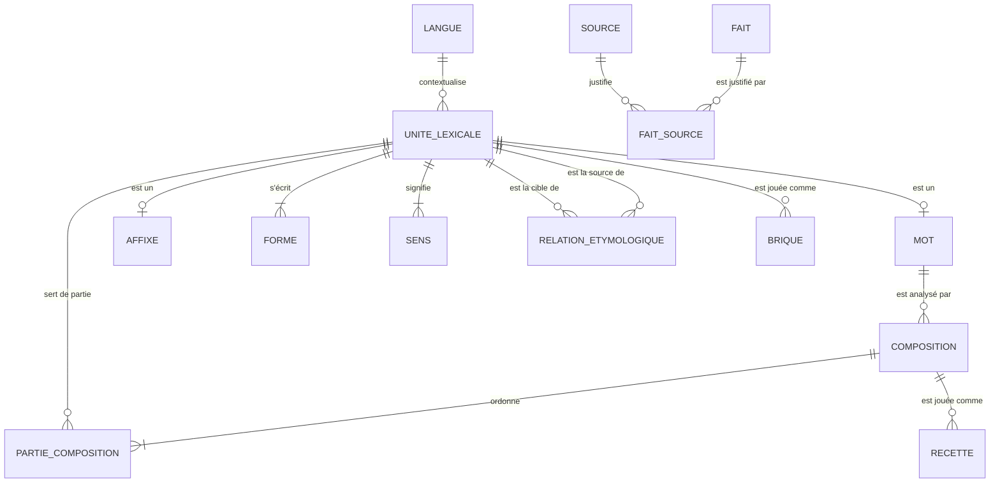
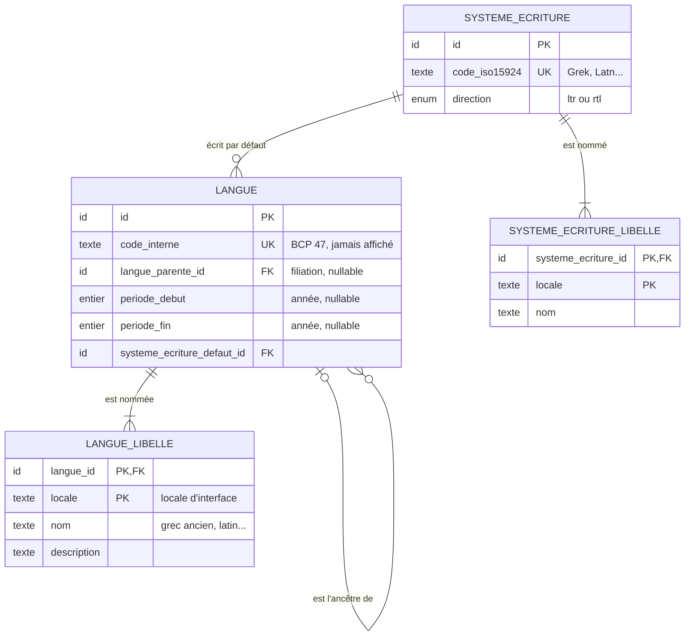
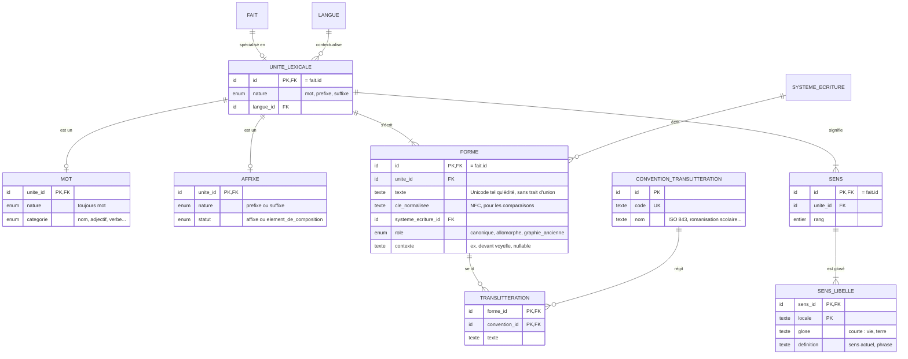
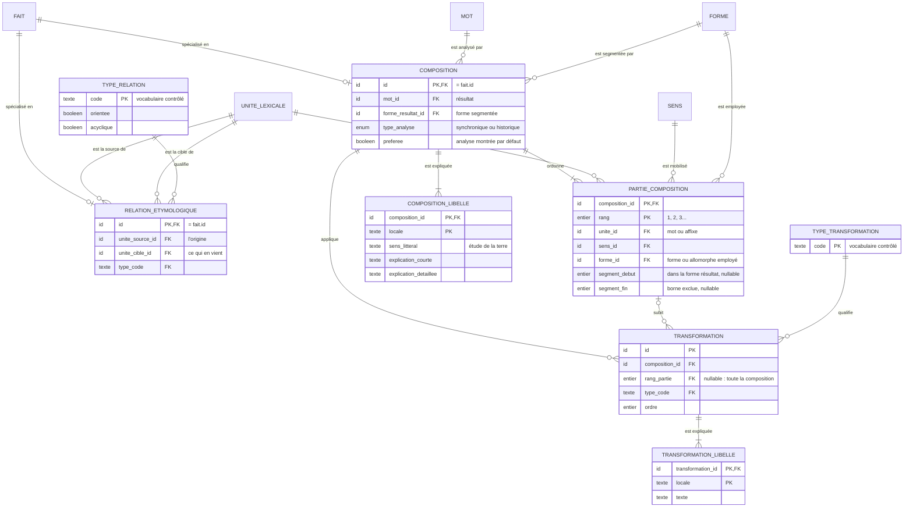
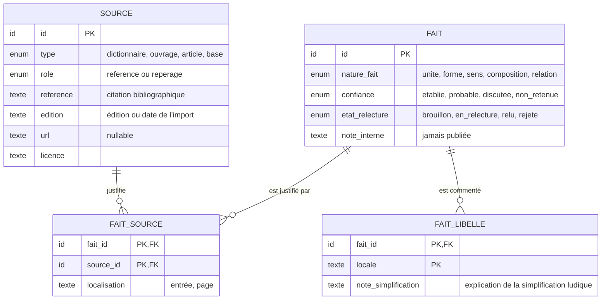
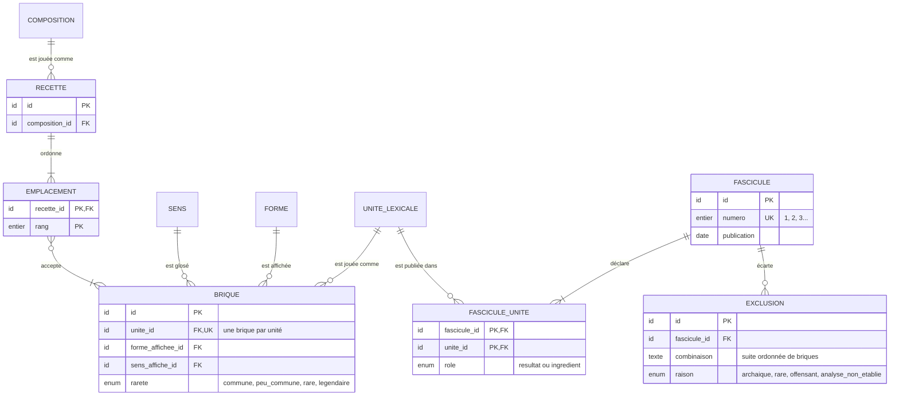

# ÉtymoLogique — Modèle de données des briques

Ce document décrit le **schéma relationnel logique** des objets au cœur du jeu : **langues, mots, préfixes et suffixes**. Il ne choisit ni base de données, ni format de fichier, ni moteur. Il fixe les entités, leurs attributs, leurs clés, leurs cardinalités et les contraintes que tout stockage devra respecter.

Une présentation illustrée est disponible sur la page [modèle de données](modele.html). Les choix structurants sont actés dans l'[ADR 0013](adr/0013-schema-des-briques.md). Le document applique les ADR [0002](adr/0002-graphe-linguistique-editorial.md) (graphe éditorial), [0003](adr/0003-recettes-de-fusion.md) (recettes), [0006](adr/0006-architecture-multilingue.md) (multilingue) et [0009](adr/0009-contenu-et-equilibrage.md) (séparation des couches).

> Les exemples étymologiques ci-dessous servent à éprouver le schéma. Ils devront être vérifiés et sourcés avant toute publication.

## Principes

1. **Identifiants opaques et stables.** Un identifiant ne contient jamais de graphie : corriger un accent ne crée pas une nouvelle brique. Les exemples utilisent `lng_01`, `unt_05`, etc.
2. **Une unité lexicale pour les mots, préfixes et suffixes.** Les trois partagent un supertype, `unite_lexicale`. Compositions, relations, sources et briques pointent donc tous vers une même cible. Un mot peut ainsi redevenir un ingrédient (*biologie* + *-iste*).
3. **La langue n'est pas une unité lexicale.** C'est le contexte d'une unité. Elle a sa carte dans le codex mais ne peut pas, par construction, devenir une brique posée sur la table.
4. **Pas de type « étymon ».** Un étymon est une unité lexicale d'une langue source (le grec *gê*), reliée par une relation étymologique. *géo-* est un préfixe **du français**, forme de composition du grec *gê*. *philo-* et *-phile* sont deux unités distinctes, reliées au même grec *phílos*.
5. **Forme, sens et translittération sont séparés de l'unité.** Une unité a une ou plusieurs graphies, un ou plusieurs sens, et chaque forme peut avoir des translittérations.
6. **Le texte d'une forme est stocké sans trait d'union.** La position vient de la nature de l'unité (préfixe ou suffixe). Une brique n'est jamais affichée en texte brut : le trait d'union n'est qu'une convention de rendu éventuelle.
7. **Tout ce qui est affirmé est un fait.** Unités, formes, sens, compositions et relations héritent du supertype `fait`. Ils portent un niveau de confiance, un état de relecture et des sources.
8. **Aucun libellé traduit dans les tables de faits.** Noms, gloses, définitions et explications vivent dans des tables `…_libelle`, indexées par locale d'interface.
9. **La couche ludique référence la couche linguistique, jamais l'inverse.** Brique, recette et rareté restent hors des faits.

## Vue d'ensemble

Le schéma se lit en quatre blocs : les langues et les écritures, les unités avec leurs formes et leurs sens, les compositions et les relations, puis le socle éditorial. Un dernier bloc esquisse les points d'ancrage de la couche ludique.

## 1. Langues et écritures

| Table | Rôle | Remarques |
|---|---|---|
| `langue` | Langue affichée dans le codex. | Le MVP compte **trois langues, sans variété** : grec ancien, latin, français. Une forme médiévale ou tardive reste rattachée à sa langue ; si la précision compte, elle va dans l'explication ou la `note_simplification`. `langue_parente_id` décrit la généalogie des langues, pas les emprunts : un emprunt se déclare entre unités. |
| `langue_libelle` | Nom affiché dans chaque locale. | Le joueur voit toujours le nom complet (ADR 0006). `code_interne` reste strictement technique. |
| `systeme_ecriture` | Alphabet grec, latin, cyrillique… | Porte la direction d'écriture, utile au rendu fragment par fragment. |

La carte de langue du codex n'est pas stockée : son verso regroupe les unités découvertes dont `langue_id` vaut cette langue.

## 2. Unités, formes et sens

| Table | Rôle | Remarques |
|---|---|---|
| `unite_lexicale` | Supertype de tout ce qui se compose ou se relie. | `nature` sert de discriminant. Chaque unité a exactement un sous-type. |
| `mot` | Lexème autonome (*géologie*, grec *gê*). | Un mot peut être un résultat de composition **et** une partie d'une autre composition. |
| `affixe` | Préfixe ou suffixe. | `statut` distingue un affixe vrai (*-iste*) d'un élément de composition savant (*géo-*, *-logie*). Pour le joueur, les deux restent des préfixes ou des suffixes. |
| `forme` | Graphie attestée. | La `forme canonique` est celle de la brique. Les allomorphes (*phil-* devant voyelle) et les graphies anciennes restent des formes de la **même** unité, jamais de nouvelles briques : le joueur pose *philo-*, et la recette applique une transformation d'allomorphie. |
| `translitteration` | Lecture d'une forme selon une convention. | Une translittération n'est pas une racine collectionnable (ADR 0006). Elle exige une convention déclarée (ADR 0005). |
| `sens` | Acception d'une unité. | Une partie de composition désigne le sens précis qu'elle mobilise. |
| `sens_libelle` | Glose et définition par locale. | La glose sert aux briques (« terre »). La définition actuelle est obligatoire pour un mot découvrable. |

**Pourquoi `nature` est répétée dans `mot` et `affixe`.** C'est la technique du discriminant partagé : le sous-type référence la paire (`unite_id`, `nature`) de `unite_lexicale`, et une contrainte fixe la valeur admise dans chaque sous-type. Une unité ne peut ainsi être à la fois un mot et un affixe, et un affixe ne peut pas changer de position en silence.

## 3. Compositions et relations étymologiques

### Composition

Une `composition` est l'analyse d'un mot en parties ordonnées. C'est une relation **n-aire** : elle ne peut pas tenir dans une relation étymologique, qui relie deux unités. Le vocabulaire de relations ne contient donc pas de type « composition ».

- **Plusieurs analyses par mot.** Un mot peut avoir une analyse synchronique (ce que le joueur recompose en français) et une analyse historique (le composé déjà formé en grec). Si deux analyses sont en concurrence, chacune porte la confiance « discutée ». `preferee` désigne celle qu'affiche la fiche.
- **Parties.** Chaque partie désigne une unité (mot ou affixe), le sens qu'elle mobilise et la forme employée. Le **segment** donne sa place dans la forme résultat : c'est ce qui permet de surligner le mot morceau par morceau avec la couleur de chaque brique. Il est nul si le mot n'est pas segmentable.
- **Sens littéral.** Il appartient à la composition, pas au mot : *philologie* signifie littéralement « amour des mots », mais sa définition actuelle est tout autre.
- **Transformations.** Elles décrivent l'écart entre les parties et le résultat (élision, voyelle de liaison, allomorphie, adaptation de graphie). Une transformation vise une partie ou l'ensemble de la composition. Son type appartient à un vocabulaire contrôlé (ADR 0003).

### Relation étymologique

Une relation relie une unité **source** (l'origine) à une unité **cible** (ce qui en vient). Vocabulaire initial :

| Code | Sens | Orientée | Acyclique |
|---|---|---|---|
| `heritage` | Transmission continue d'une langue à sa descendante. | oui | oui |
| `emprunt` | Passage d'une langue à une autre. | oui | oui |
| `derivation` | Formation à l'intérieur d'une langue. | oui | oui |
| `forme_de_composition` | Élément de composition tiré d'un mot (*géo-* ← *gê*). | oui | oui |
| `adaptation` | Réfection de forme ou de graphie. | oui | oui |
| `apparentement` | Parenté sans filiation directe connue. | non | non |

Les chemins longs se construisent en enchaînant des relations : français *étymologie* ← latin *etymologia* ← grec *etumología*. Le verso d'une carte (« formes dans chaque langue, 2 sur 3 ») n'est donc pas stocké : c'est la fermeture de ces relations depuis l'unité, filtrée par ce que le joueur a découvert.

## 4. Socle éditorial : faits et sources

Une source a un **rôle** ([ADR 0014](adr/0014-sources-et-fascicules.md)) :

- `reference` : dictionnaire ou ouvrage qui fait autorité (TLFi, Académie française, Gaffiot, Bailly, Chantraine…). C'est elle qui fixe le niveau de confiance ;
- `reperage` : le Wiktionnaire et les outils d'extraction. Un fait qui n'a qu'une source de repérage reste un `brouillon` : il n'est jamais publié.

`fait` est le supertype éditorial des unités, formes, sens, compositions et relations : leur identifiant **est** celui du fait. Un seul lien `fait_source` suffit donc à sourcer n'importe quelle affirmation, sans clé étrangère polymorphe.

- Le **niveau de confiance** ne devient jamais une rareté (ADR 0009).
- `note_interne` reste hors de l'artefact client (ADR 0005). `note_simplification` est publiée et traduite.
- Une langue, une écriture ou une convention ne sont pas des faits : ce sont des référentiels.

## 5. Points d'ancrage de la couche ludique

Cette couche n'est qu'esquissée ici. Elle sera détaillée dans un travail séparé.

- Une **brique** pointe vers une unité lexicale : mot, préfixe ou suffixe. Aucune langue ne peut donc être posée sur la table.
- **Une brique par unité**, et une unité a au plus une brique. Un allomorphe n'est jamais une brique à part : la recette qui l'emploie le déclare comme transformation (ADR 0003). La réserve, le tirage des plis et la carte du codex restent donc uniques pour *philo-*, qu'il s'écrive *philo* ou *phil*.
- Une **recette** s'appuie sur une composition validée. Elle ne peut pas inventer un fait (ADR 0009). Ses emplacements acceptent une ou plusieurs briques (variantes admises, ADR 0003).
- Les **cartes du codex** sont dérivées. Une unité a sa propre carte **si et seulement si** elle est référencée par une brique ou par le résultat d'une recette :
  - carte de mot ou de brique : l'unité, ses formes, ses sens et les compositions où elle apparaît ;
  - carte de langue : les unités de cette langue.
- Les **étymons** (grec *gê*, *phílos*, latin *etymologia*) n'ont pas de carte propre. Ils apparaissent au verso des cartes qui en descendent (« formes dans chaque langue ») et sur la carte de leur langue.
- Deux **homographes** sont deux unités, donc deux briques et deux cartes. Rien dans leur identifiant ni dans leur libellé ne les numérote : le joueur les distingue par les autres attributs de la carte (voir les contraintes).
- Un **fascicule** est l'unité de publication du contenu : 20 à 40 mots environ tous les 30 jours ([ADR 0014](adr/0014-sources-et-fascicules.md)). Il déclare toutes les unités dont il a besoin :
  - `resultat` : les mots qu'il publie. Un mot est le résultat d'**un seul** fascicule ;
  - `ingredient` : les préfixes, suffixes et mots qui servent à ses recettes. Une unité déjà publiée peut être reprise comme ingrédient par plusieurs fascicules.
- Une **exclusion** enregistre une combinaison attestée volontairement non publiée, avec sa raison.
- Rareté, poids de tirage, graines, jalons et visibilité restent dans la couche ludique.
- Les **familles** sont hors du périmètre de ce document.

## Contraintes d'intégrité

Le schéma logique ne suffit pas : ces règles doivent être vérifiées, soit par le stockage, soit par le validateur de publication ([ADR 0005](adr/0005-pipeline-de-contenu.md)).

### Unités

- Chaque unité a exactement un sous-type, cohérent avec `nature`.
- Chaque unité a au moins un sens et exactement une forme `canonique`.
- La forme canonique utilise un système d'écriture compatible avec la langue de l'unité.
- Deux unités peuvent partager (`langue_id`, `nature`, `cle_normalisee` de la forme canonique) : ce sont des **homographes**, d'origines différentes. Le critère est l'origine : même origine et sens différents, c'est **une** unité avec plusieurs sens ; origines différentes, ce sont **deux** unités.
- Deux homographes doivent se distinguer par les attributs visibles de leur carte : la glose du sens affiché par la brique diffère dans chaque locale, et leurs étymons (sources des relations) diffèrent. Le validateur refuse deux homographes indiscernables.
- `forme.texte` ne commence ni ne finit par un trait d'union.

### Compositions

- Le résultat est une unité de nature `mot`, et `forme_resultat_id` est une forme de ce mot.
- Une composition a au moins deux parties, avec des rangs uniques et continus à partir de 1.
- Une partie n'est jamais le résultat lui-même, ni un mot composé à partir de ce résultat (pas de cycle).
- `sens_id` et `forme_id` d'une partie appartiennent à l'unité de cette partie.
- Un préfixe n'apparaît pas au dernier rang et un suffixe n'apparaît pas au premier.
- Les segments, lorsqu'ils existent, sont dans les bornes de la forme résultat et ne se chevauchent pas.
- Au plus une composition `preferee` par mot.

### Relations

- La source et la cible sont différentes.
- Pas de cycle pour les types `acyclique`.
- Pas de doublon (`unite_source_id`, `unite_cible_id`, `type_code`).
- Un `emprunt` relie deux langues différentes, un `heritage` suit la filiation des langues.

### Éditorial et multilingue

- Tout fait publié a au moins une source de rôle `reference`. Le Wiktionnaire seul ne suffit jamais.
- `etablie` : une source de référence affirme le fait. `probable` : une source de référence le présente comme une hypothèse. `discutee` : deux sources de référence sont en désaccord.
- Un fait publié est `relu`. `non_retenue` n'est jamais publié comme solution.
- Une ligne de libellé par (objet, locale). La locale de référence est complète pour tout objet publié.
- Une translittération a toujours une convention.

### Fascicules

- **Unicité** : un mot n'a qu'une ligne `resultat`, tous fascicules confondus.
- **Autonomie** : chaque partie d'une recette d'un fascicule est une unité publiée dans ce fascicule ou dans un précédent, et figure dans ses lignes `ingredient`.
- **Fermeture** : pour toute suite ordonnée de briques publiées dans les fascicules 1 à N, jusqu'au nombre maximal de briques sur la table, un mot attesté par une source de référence est publié ou fait l'objet d'une exclusion relue.

## Versionnage

Chaque publication est un **instantané immuable** de toutes les tables ([ADR 0002](adr/0002-graphe-linguistique-editorial.md)). Le schéma ne porte donc pas de colonnes temporelles : les identifiants restent stables d'une version à l'autre, et un manifeste associe une version linguistique et une version ludique ([ADR 0009](adr/0009-contenu-et-equilibrage.md)). Supprimer un objet publié, ou changer la nature d'une unité, passe par une migration explicite.

## Exemples travaillés

### Langues

| `langue` | `code_interne` | `langue_parente_id` | nom (`fr`) |
|---|---|---|---|
| `lng_01` | `grc` | — | grec ancien |
| `lng_02` | `la` | — | latin |
| `lng_03` | `fr` | `lng_02` | français |

La filiation `lng_03` → `lng_02` est simplifiée (le français descend du latin parlé) : `note_simplification` le signale.

### *géologie* : préfixe savant, suffixe emprunté

| Unité | Nature | Langue | Forme canonique | Glose |
|---|---|---|---|---|
| `unt_01` | mot | grec ancien | γῆ (*gê*) | terre |
| `unt_02` | préfixe (élément de composition) | français | géo | terre |
| `unt_03` | suffixe (élément de composition) | grec ancien | λογία (*logía*) | étude, discours |
| `unt_04` | suffixe (élément de composition) | français | logie | étude |
| `unt_05` | mot | français | géologie | — |

- Relations : `unt_01` → `unt_02` (`forme_de_composition`) ; `unt_03` → `unt_04` (`emprunt`, via le latin, simplifié).
- Composition `cmp_01` de `unt_05`, synchronique : rang 1 `unt_02`, segment [0, 3) ; rang 2 `unt_04`, segment [3, 8).
- Libellé : sens littéral « étude de la terre ». La définition actuelle vient du sens de `unt_05`.

### *philo-* et *-phile* : deux briques, un même étymon

| Unité | Nature | Langue | Formes |
|---|---|---|---|
| `unt_06` | mot | grec ancien | φίλος (*phílos*), glose « ami » |
| `unt_07` | préfixe | français | philo (canonique), phil (allomorphe, devant voyelle) |
| `unt_08` | suffixe | français | phile (canonique) |

Relations : `unt_06` → `unt_07` et `unt_06` → `unt_08`, toutes deux `forme_de_composition`. Le codex peut relier *philo-* et *-phile* en remontant à `unt_06`, sans qu'aucune brique ne change de position.

- `unt_07` n'a qu'une brique, affichée *philo-*. Pour *philanthrope*, le joueur pose *philo-* : la partie de rang 1 emploie la forme *phil*, et la recette déclare une transformation d'`allomorphie` (« le o tombe devant une voyelle »).
- `unt_06` (*phílos*) n'a pas de carte propre : il apparaît au verso de *philo-* et de *-phile*, et sur la carte « grec ancien ».

### *biologiste* : un mot comme ingrédient, avec une transformation

| Unité | Nature | Forme |
|---|---|---|
| `unt_09` | mot | biologie |
| `unt_10` | suffixe (affixe) | iste |
| `unt_11` | mot | biologiste |

- Composition `cmp_02` de `unt_11` : rang 1 `unt_09`, segment [0, 6) (« biolog ») ; rang 2 `unt_10`, segment [6, 10).
- Transformation sur le rang 1 : type `elision`, « le e final de *biologie* tombe devant *-iste* ».
- `unt_09` est lui-même le résultat d'une autre composition (*bio-* + *-logie*) : le graphe reste acyclique.

### *étymologie* : une chaîne de langues et deux analyses

| Unité | Langue | Forme |
|---|---|---|
| `unt_12` | grec ancien | ἐτυμολογία (*etumología*) |
| `unt_13` | latin | etymologia |
| `unt_14` | français | étymologie |

- Relations : `unt_12` → `unt_13` (`emprunt`) ; `unt_13` → `unt_14` (`emprunt`). Le verso de la carte affiche trois formes, une par langue.
- Composition historique de `unt_12` : grec *étumon* + *-logía*.
- Composition synchronique préférée de `unt_14` : *étymo-* + *-logie*, segments [0, 5) et [5, 10). C'est elle que joue la recette.

### *philosophie* : un composé déjà formé ailleurs

Le joueur recompose *philo-* + *-sophie*, mais le mot n'a pas été formé en français : il vient du grec *philosophía* par le latin. Le schéma le dit sans tricher :

- une composition synchronique de *philosophie*, jouable, avec une `note_simplification` publiée ;
- une composition historique de grec *philosophía* ;
- une chaîne d'emprunts : grec, puis latin, puis français.

### *a-* et *a-* : deux homographes, deux cartes

| Unité | Nature | Langue | Forme | Glose | Étymon |
|---|---|---|---|---|---|
| `unt_15` | préfixe | français | a | sans, privé de | grec *a-* privatif |
| `unt_16` | préfixe | français | a | vers | latin *ad-* |

- Même langue, même nature, même forme : deux unités, deux briques, deux cartes (*amoral* d'un côté, *amener* de l'autre).
- Aucun numéro ne les distingue. Le joueur les reconnaît à la glose, toujours affichée sur la brique, et à l'étymon, visible au verso de la carte. Le validateur vérifie que ces deux attributs diffèrent.

## Décisions prises

- **Une brique par unité.** Un allomorphe est une transformation, jamais une brique.
- **Trois langues, sans variété** dans le MVP : grec ancien, latin, français.
- **Pas de carte pour les étymons.** Une unité a une carte si elle est une brique ou le résultat d'une recette.
- **Homographes : deux cartes**, distinguées par leur glose et leur étymon, sans numéro.

## Questions ouvertes

- **Segments.** Faut-il compter les segments en points de code ou en graphèmes, pour les écritures à diacritiques combinants ?
- **Familles.** Faut-il un regroupement éditorial (couche ludique) ou une notion dérivée des relations ?
- **Retour d'une exclusion.** Que dit le jeu quand le joueur tente une combinaison attestée mais écartée ?
- **Traductions.** Les gloses et définitions ne seront d'abord rédigées qu'en français : faut-il imposer une locale de référence unique ?
- **Homographes sur la table.** Quand le joueur pose le mauvais homographe, faut-il un indice « même forme, autre sens » plutôt qu'un échec neutre ?
